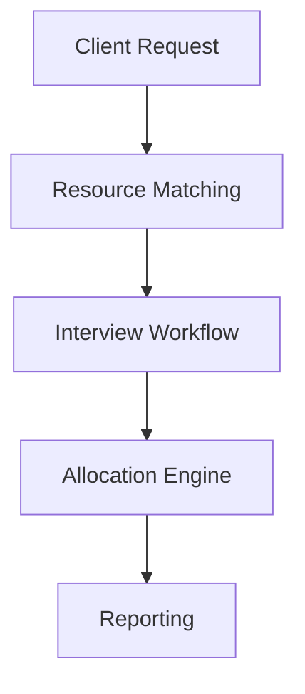

# Resource Allocation SaaS

Multi-tenant SaaS platform for resource allocation, staffing workflows and operational management.

## Overview
Platform designed to manage resource allocation and optimize staffing workflows.

## Core Features
- Resource allocation workflows
- Candidate-resource matching
- Multi-tenant architecture
- Workflow automation
- Analytics and reporting

## Stack
- Python
- Flask
- PostgreSQL
- SaaS Architecture
- APIs & Automation

## Architecture

## Status
Active product under development.
